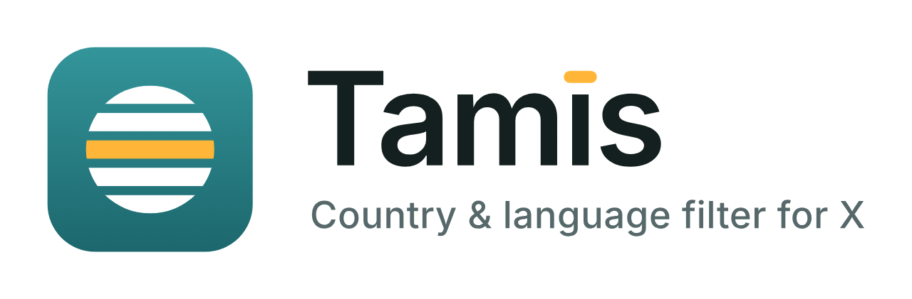

<picture>
  <source media="(prefers-color-scheme: dark)" srcset="store/lockup-dark.png" />
  
</picture>

# Tamis: country & language filter for X

Tamis (formerly X Country Block) is a browser extension for Chrome, Edge
and Firefox that filters posts on x.com and twitter.com by the author's
country or region, or by the post's language. Matching posts are hidden,
or highlighted if you want to look first.

- [Chrome Web Store](https://chromewebstore.google.com/detail/gbealimmmdpllngehcjmgaifdmodijhm)
- [Firefox Add-ons](https://addons.mozilla.org/firefox/addon/x-country-block/)
- [Privacy policy](https://andreasne89.github.io/x-country-block/privacy.html)

## What it does

Open the popup and tick countries, regions or languages. Changes apply
straight away, with no reload.

- **Hide** matching posts, or **highlight** them with an outline whose
  tooltip says why they matched. In Hide mode, reposts and quotes of a
  match are hidden too.
- 250 countries and territories, 20 regions and the 69 languages X
  detects, with search. A region covers every country in it.
- The toolbar badge shows how many posts on the page are filtered.
- Works on the home timeline, search, profiles and notifications.
- **Focus mode** (Pro, $5.99 once, 7-day free trial): show only posts from
  the places and languages you tick and set the rest aside. Payment is a
  Stripe Payment Link; there is no Tamis account.

## How it decides

Tamis only uses data X has already loaded in the page. It makes no requests
of its own.

- The post's language tag and the account's language.
- The "Account based in" or "Connected via" line from X's About this
  account. When X sends it, it wins.
- The profile location (`legacy.location`, or `location.location` in the
  2026 data), which fills the gap on the timeline: "Boston, MA" means the
  United States, not Morocco. Vanity text such as "Mar-a-Lago" does not
  invent a country.
- A post's place tag, and region words.

In Hide mode a post with no location signal stays visible. In Focus mode
only proven matches stay and everything else is set aside, including
posts with no signal; with nothing ticked, everything shows. A quote from
a ticked place does not keep a parent post from elsewhere.

X's location labels can be wrong, for example for people who use a VPN or
travel. Tamis passes them on as they are and adds no labels to anyone.

## Privacy

Everything runs in your browser. Tamis has no servers and no analytics.
Your picks, your Focus mode status and a size-limited cache of public
profile data for accounts already shown stay in `chrome.storage.local` on
your device, and uninstalling removes them. See the
[privacy policy](docs/privacy.html).

## Develop

Requires Node.js 22.

```bash
npm ci
npm test              # version check, then unit tests
npm run typecheck     # tsc --noEmit
npm run build         # development build of dist/ (Chrome, Edge)
npm run build:firefox # development build of dist-firefox/
```

Development builds are unminified and show a **Test unlock** button for
Focus mode. Never upload them.

### Load unpacked

- Chrome or Edge: `chrome://extensions`, turn on Developer mode, **Load
  unpacked**, select `dist/`.
- Firefox 140 or newer: `about:debugging#/runtime/this-firefox`, **Load
  Temporary Add-on**, select `dist-firefox/manifest.json`.

### Release packages

| Command | Output | Upload to |
|---------|--------|-----------|
| `npm run build:prod` | `release/x-country-block-0.2.0-chrome.zip` | Chrome Web Store, Edge Add-ons |
| `npm run build:firefox:prod` | `release/x-country-block-0.2.0-firefox.zip` | Firefox Add-ons |
| `npm run source:zip` | `release/x-country-block-0.2.0-source.zip` | Firefox Add-ons (source code) |

Mozilla reviewers: [BUILD.md](BUILD.md) explains how to rebuild the Firefox
package from the source archive.

To release a new version, update `package.json` and `package-lock.json`
(`npm version <x.y.z> --no-git-tag-version`), both manifests, the zip names
in this README, BUILD.md and `store/listing.md`, and add a CHANGELOG
heading. `npm run check-version` fails until they all agree, and so do the
tests and builds.

### Brand and store assets

`brand/` holds the logo masters and `store/` the store art and copy
(`store/listing.md`). `node scripts/render-brand.mjs` regenerates
`brand/`, `icons/` and `store/` images with headless Chrome; see
[brand/README.md](brand/README.md).

## Layout

| Path | Purpose |
|------|---------|
| `src/hook/` | Runs in the page on x.com and reads the GraphQL responses X already receives |
| `src/content/` | Matches posts, hides or highlights them, reports the badge count |
| `src/background/` | Toolbar badge and the Focus mode unlock |
| `src/popup/` | Popup UI |
| `src/shared/` | Matching, settings, parsing, country, region and language data |
| `docs/privacy.html` | Privacy policy and Stripe success page (GitHub Pages) |
| `scripts/` | Build, packaging, version check and brand rendering |
| `test/`, `scripts/test/` | Unit tests (vitest) |

Tamis is not affiliated with or endorsed by X Corp.
